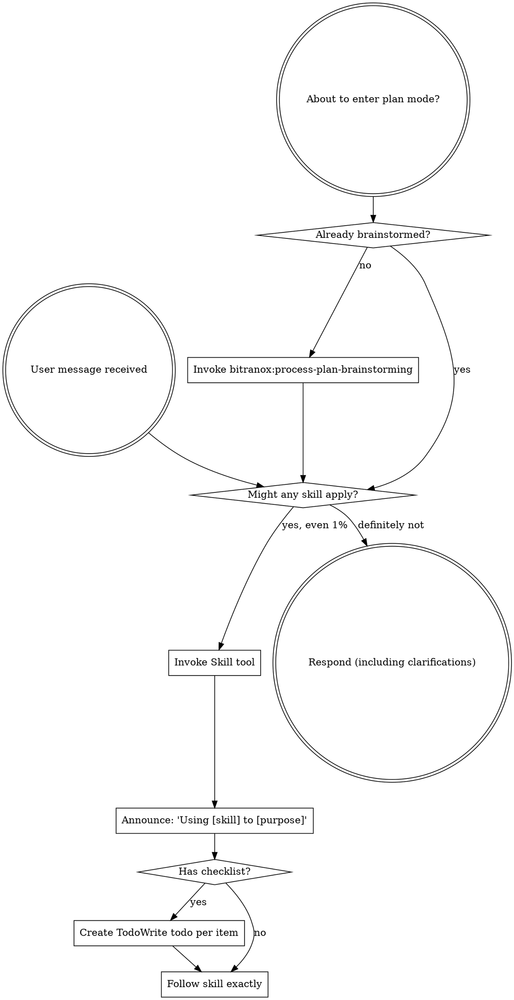

<SUBAGENT-STOP>
If you were dispatched as a subagent to execute a specific, already-scoped task, skip this skill and do that task.
</SUBAGENT-STOP>

<EXTREMELY-IMPORTANT>
If you think there is even a 1% chance a skill might apply to what you are doing, you ABSOLUTELY MUST invoke the skill.

IF A SKILL APPLIES TO YOUR TASK, YOU DO NOT HAVE A CHOICE. YOU MUST USE IT.

This is not negotiable. This is not optional. You cannot rationalize your way out of this.
</EXTREMELY-IMPORTANT>

## Instruction Priority

bitranox skills override default system-prompt behavior where they conflict, but **user instructions always take precedence**:

1. **User's explicit instructions** (CLAUDE.md, AGENTS.md, direct requests) - highest priority
2. **bitranox skills** - override default system behavior where they conflict
3. **Default system prompt** - lowest priority

If CLAUDE.md says "don't use TDD" and a skill says "always use TDD", follow the user's instructions. The user is in control.

## How to Access Skills

**Never read a skill's `SKILL.md` manually with file tools.** Always invoke it through the `Skill` tool so it activates properly and you get the current version, not a stale memory of it.

**In Claude Code:** Use the `Skill` tool. When you invoke a skill, its content is loaded and presented to you: follow it directly. Use the Read tool only for the supporting files a skill references (its `scripts/`, templates, references), never to re-read the skill body itself.

**In other environments:** Check your platform's documentation for how skills are loaded.

# Using Skills

## The Rule

**Invoke relevant or requested skills BEFORE any response or action.** Even a 1% chance a skill might apply means that you should invoke the skill to check. If an invoked skill turns out to be wrong for the situation, you don't need to use it.

Before entering plan mode, brainstorm first with `bitranox:process-plan-brainstorming` unless you already have.

## Red Flags

These thoughts mean STOP - you're rationalizing:

| Thought                             | Reality                                                                                       |
|-------------------------------------|-----------------------------------------------------------------------------------------------|
| "This is just a simple question"    | Questions are tasks. Check for skills.                                                        |
| "I need more context first"         | Skill check comes BEFORE clarifying questions.                                                |
| "Let me explore the codebase first" | Skills tell you HOW to explore. Check first.                                                  |
| "I can check git/files quickly"     | Files lack conversation context. Check for skills.                                            |
| "Let me gather information first"   | Skills tell you HOW to gather information.                                                    |
| "This doesn't need a formal skill"  | If a skill exists, use it.                                                                    |
| "I remember this skill"             | Skills evolve. Read current version.                                                          |
| "This doesn't count as a task"      | Action = task. Check for skills.                                                              |
| "The skill is overkill"             | Simple things become complex. Use it.                                                         |
| "I'll just do this one thing first" | Check BEFORE doing anything.                                                                  |
| "This feels productive"             | Undisciplined action wastes time. Skills prevent this.                                        |
| "I know what that means"            | Knowing the concept is not using the skill. Invoke it.                                        |
| "I'll just start planning"          | Brainstorm first (bitranox:process-plan-brainstorming) before plan mode, unless already done. |
| "I'll read the skill file myself"   | Never open SKILL.md with file tools. Invoke it via the Skill tool.                            |

## Skill Priority

When multiple skills could apply, use this order:

1. **Process skills first** (`bitranox:process-plan-brainstorming`, `bitranox:process-debug-systematic`) - these determine HOW to approach the task
2. **Implementation skills second** - these guide execution

"Let's build X" -> brainstorming first, then implementation skills.
"Fix this bug" -> systematic-debugging first, then domain-specific skills.

## Skills Span Every Domain, Not Just Process

bitranox ships far more than the workflow/process skills. Before concluding "no skill applies," scan these domains: there is very likely a relevant one. The authoritative, current list is your injected available-skills - invoke any by name with the Skill tool.

- **Process and quality:** `process-plan-brainstorming`, `process-plan-writing-plans`, `process-plan-executor`, `process-agents-subagent-driven-development`, `process-agents-dispatching-parallel`, `process-test-driven-development`, `process-test-design`, `process-debug-systematic`, `process-review-verification-before-completion`, `process-review-requesting-code-review`, `process-review-receiving-code-review`, `process-ship-finishing-development-branch`, `git-worktrees`, `process-review-enhance-code-quality`, `meta-self-improve`, `meta-dream-project`, `meta-dream-global`, `meta-dream-global-deep`, `meta-collect-knowledge`, `meta-memory-settings`, `meta-skill-writer`, `meta-adopting-external-skills`
- **Architecture:** `coding-python-clean-architecture`, `coding-bash-clean-architecture`, `coding-python-enforce-data-architecture-strict`, `coding-resilience`
- **Language and tooling references:** `coding-bash-reference`, `coding-rust`, `coding-input-sanitization`, `coding-python-uv`, `coding-python-rpyc`, `coding-python-textual`, `coding-python-performance-review`, `coding-python-use-modern-libraries`, `coding-python-gitignore`
- **Editing structured files and docs:** `files-edit-json`, `files-edit-toml`, `files-edit-xml`, `files-edit-yml`, `docs-md-table-formatting`, `docs-convert-markitdown`
- **Shell / git / ssh / remote-control mechanics:** `compuse-bash`, `compuse-git`, `compuse-ssh`, `compuse-vnc`
- **Writing:** `write-humanize-de`, `write-humanize-en`
- **Infrastructure and ops:** `infra-proxmox`, `infra-proxmox-bindsnap`, `net-rotating-proxies`
- **Build / test / release tooling:** `devops-bmk`
- **Web / frontend:** `web-frontend-responsive-ux`
- **Security:** `sec-appsec-web-baseline`
- **Persuasion and business:** `marketing-rory`

This grouping is orientation, not the source of truth: skills get added and renamed. Trust the available-skills list for what currently exists, and never skip a domain skill just because the task looked like "only" a coding task (e.g. editing a YAML file -> `files-edit-yml`; writing a user-facing message -> `write-humanize-en`/`write-humanize-de`; touching a Proxmox host -> `infra-proxmox`).

## Work like a pathfinder

Beyond finding and using skills: while you work, leave every file better than you found it, accept NO
technical debt (point mistakes out clearly, never "works anyway"), put an out-of-scope fix in its own
worktree (`bitranox:git-worktrees`) instead of bolting it on, and clean up temporary scaffolding when
done. The full discipline is in `bitranox:meta-self-improve` ("Pathfinder discipline").

## Skill Types

**Rigid** (TDD, debugging): Follow exactly. Don't adapt away discipline.

**Flexible** (patterns): Adapt principles to context.

The skill itself tells you which.

## User Instructions

Instructions say WHAT, not HOW. "Add X" or "Fix Y" doesn't mean skip workflows.
