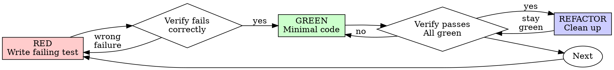

# Test-Driven Development (TDD)

> Adapted from the superpowers plugin (MIT).

## Overview

Write the test first. Watch it fail. Write minimal code to pass.

**Core principle:** If you didn't watch the test fail, you don't know if it tests the right thing.

> For test DESIGN and quality - real-vs-mock, dependency injection over monkeypatching, the adversarial
> input battery, determinism/order-independence, and pruning low-value tests - see
> `bitranox:process-test-design`. This skill owns the red-green discipline; that one owns what to write.

**Violating the letter of the rules is violating the spirit of the rules.**

## When to Use

**Always:**
- New features
- Bug fixes
- Refactoring
- Behavior changes

**Exceptions (ask your human partner):**
- Throwaway prototypes
- Generated code
- Configuration files

Thinking "skip TDD just this once"? Stop. That's rationalization.

## The Iron Law

```
NO PRODUCTION CODE WITHOUT A FAILING TEST FIRST
```

Write code before the test? Delete it. Start over.

**No exceptions:**
- Don't keep it as "reference"
- Don't "adapt" it while writing tests
- Don't look at it
- Delete means delete

Implement fresh from tests. Period.

## Red-Green-Refactor



### RED - Write Failing Test

Write one minimal test showing what should happen.

<Good>
```typescript
test('retries failed operations 3 times', async () => {
  let attempts = 0;
  const operation = () => {
    attempts++;
    if (attempts < 3) throw new Error('fail');
    return 'success';
  };

  const result = await retryOperation(operation);

  expect(result).toBe('success');
  expect(attempts).toBe(3);
});
```
Clear name, tests real behavior, one thing
</Good>

<Bad>
```typescript
test('retry works', async () => {
  const mock = jest.fn()
    .mockRejectedValueOnce(new Error())
    .mockRejectedValueOnce(new Error())
    .mockResolvedValueOnce('success');
  await retryOperation(mock);
  expect(mock).toHaveBeenCalledTimes(3);
});
```
Vague name, tests mock not code
</Bad>

**Requirements:**
- One behavior
- Clear name
- Real code (no mocks unless unavoidable)

### Verify RED - Watch It Fail

**MANDATORY. Never skip.**

```bash
npm test path/to/test.test.ts
```

Confirm:
- Test fails (not errors)
- Failure message is expected
- Fails because feature missing (not typos)

**Test passes?** You're testing existing behavior. Fix test.

**Test errors?** Fix error, re-run until it fails correctly.

### GREEN - Minimal Code

Write simplest code to pass the test.

<Good>
```typescript
async function retryOperation<T>(fn: () => Promise<T>): Promise<T> {
  for (let i = 0; i < 3; i++) {
    try {
      return await fn();
    } catch (e) {
      if (i === 2) throw e;
    }
  }
  throw new Error('unreachable');
}
```
Just enough to pass
</Good>

<Bad>
```typescript
async function retryOperation<T>(
  fn: () => Promise<T>,
  options?: {
    maxRetries?: number;
    backoff?: 'linear' | 'exponential';
    onRetry?: (attempt: number) => void;
  }
): Promise<T> {
  // YAGNI
}
```
Over-engineered
</Bad>

Don't add features, refactor other code, or "improve" beyond the test.

### Verify GREEN - Watch It Pass

**MANDATORY.**

```bash
npm test path/to/test.test.ts
```

Confirm:
- Test passes
- Other tests still pass
- Output pristine (no errors, warnings)

**Test fails?** Fix code, not test.

**Other tests fail?** Fix now.

### Scenario-Based RED: Can It Even Fail? (redcheck)

A RED is not always code. When it is a PROMPT handed to an agent - proving the agent takes the
wrong action without a fix, rather than proving a function returns the wrong value - "watch it
fail" gets two extra failure modes that a compiler or a test runner never has:

1. **Inherited coverage.** The agent under test is handed everything it starts with (an ancestor
   config cascade, shipped reference material) before it ever sees your scenario. If the lesson
   the RED is meant to test is already written down there, the agent answers from that - not from
   your scenario - and the RED passes whatever the scenario says.
2. **Telegraphing.** The scenario names the trap, pre-diagnoses the cause, or frames the decision
   as suspicious, so the prompt hands over its own answer.

Both leaks make a RED that CANNOT fail look exactly like a good result: it fails, for the wrong
reason, and nothing about the transcript says so.

`scripts/redcheck.py` checks a scenario for both leaks before an agent dispatch is spent on it:

```
uv run scripts/redcheck.py --scenario scenario.txt --corpus-cascade . --json
uv run scripts/redcheck.py --scenario scenario.txt --answer conclusion.txt --corpus docs/ --json
```

**"Is my RED contaminated by what the agent already knows?" is what `--corpus-cascade DIR`
answers.** Leak 1 is about the agent's own always-loaded context, so pointing the check at some
docs directory tests the wrong thing. Give it the directory the agent would be dispatched in and
it assembles that context itself: every `CLAUDE.md` and `CLAUDE.local.md` from there up to the
filesystem root, plus every memory fact body under a `.claude-memory/facts/` on that chain. It
walks the filesystem to find them, because project `CLAUDE.md` files and memory stores are
routinely gitignored and any gitignore-aware search drops them silently, leaving a small corpus
in which everything looks clean.

Installed plugin skills are deliberately not assembled - where they live depends on the reader's
plugin cache and installed versions, and a built-in guess would report a falsely clean corpus on
someone else's machine. Pass `--corpus ~/.claude/skills` or wherever yours actually are.

**The two answers are not worth the same, and the tool says which one it gave you.** A hit is
STRONG evidence: the lesson demonstrably sits in reachable context, and the report names the file
it is in. A clean result is WEAK: the check compares distinctive terms, so it cannot see a
paraphrase, and "no hit" means NOT CAUGHT rather than absent. Do not read a clean run as a sealed
fixture.

| Exit | Meaning                                                                                            |
|------|----------------------------------------------------------------------------------------------------|
| 0    | clean - neither leak found. Rules out these two reasons; does not prove the RED CAN fail           |
| 1    | a leak was found - the report names the document that teaches it, or the phrase that telegraphs it |
| 2    | usage or IO error                                                                                  |
| 3    | unchecked - the corpus assembled 0 documents, so the inherited check never ran                     |

Exit 3 is its own outcome for a reason: an empty corpus makes every scenario look clean, so a
mistyped start directory would otherwise read as a pass. The run always prints how many documents
it read.

If a hit comes back, rewrite the scenario (a different domain, de-telegraphed prose) and re-check
before dispatching the real baseline run. If your corpus reuses one vocabulary throughout and
nothing ever hits, raise `--rarity-max-fraction`; if boilerplate hits, lower it.

### REFACTOR - Clean Up

After green only:
- Remove duplication
- Improve names
- Extract helpers

Keep tests green. Don't add behavior.

### Repeat

Next failing test for next feature.

## Good Tests

| Quality          | Good                                | Bad                                                 |
|------------------|-------------------------------------|-----------------------------------------------------|
| **Minimal**      | One thing. "and" in name? Split it. | `test('validates email and domain and whitespace')` |
| **Clear**        | Name describes behavior             | `test('test1')`                                     |
| **Shows intent** | Demonstrates desired API            | Obscures what code should do                        |

## Why Order Matters

**"I'll write tests after to verify it works"**

Tests written after code pass immediately. Passing immediately proves nothing:
- Might test wrong thing
- Might test implementation, not behavior
- Might miss edge cases you forgot
- You never saw it catch the bug

Test-first forces you to see the test fail, proving it actually tests something.

**"I already manually tested all the edge cases"**

Manual testing is ad-hoc. You think you tested everything but:
- No record of what you tested
- Can't re-run when code changes
- Easy to forget cases under pressure
- "It worked when I tried it" ≠ comprehensive

Automated tests are systematic. They run the same way every time.

**"Deleting X hours of work is wasteful"**

Sunk cost fallacy. The time is already gone. Your choice now:
- Delete and rewrite with TDD (X more hours, high confidence)
- Keep it and add tests after (30 min, low confidence, likely bugs)

The "waste" is keeping code you can't trust. Working code without real tests is technical debt.

**"TDD is dogmatic, being pragmatic means adapting"**

TDD IS pragmatic:
- Finds bugs before commit (faster than debugging after)
- Prevents regressions (tests catch breaks immediately)
- Documents behavior (tests show how to use code)
- Enables refactoring (change freely, tests catch breaks)

"Pragmatic" shortcuts = debugging in production = slower.

**"Tests after achieve the same goals - it's spirit not ritual"**

No. Tests-after answer "What does this do?" Tests-first answer "What should this do?"

Tests-after are biased by your implementation. You test what you built, not what's required. You verify remembered edge cases, not discovered ones.

Tests-first force edge case discovery before implementing. Tests-after verify you remembered everything (you didn't).

30 minutes of tests after ≠ TDD. You get coverage, lose proof tests work.

## Common Rationalizations

| Excuse                                 | Reality                                                                 |
|----------------------------------------|-------------------------------------------------------------------------|
| "Too simple to test"                   | Simple code breaks. Test takes 30 seconds.                              |
| "I'll test after"                      | Tests passing immediately prove nothing.                                |
| "Tests after achieve same goals"       | Tests-after = "what does this do?" Tests-first = "what should this do?" |
| "Already manually tested"              | Ad-hoc ≠ systematic. No record, can't re-run.                           |
| "Deleting X hours is wasteful"         | Sunk cost fallacy. Keeping unverified code is technical debt.           |
| "Keep as reference, write tests first" | You'll adapt it. That's testing after. Delete means delete.             |
| "Need to explore first"                | Fine. Throw away exploration, start with TDD.                           |
| "Test hard = design unclear"           | Listen to test. Hard to test = hard to use.                             |
| "TDD will slow me down"                | TDD faster than debugging. Pragmatic = test-first.                      |
| "Manual test faster"                   | Manual doesn't prove edge cases. You'll re-test every change.           |
| "Existing code has no tests"           | You're improving it. Add tests for existing code.                       |

## Red Flags - STOP and Start Over

- Code before test
- Test after implementation
- Test passes immediately
- Can't explain why test failed
- Tests added "later"
- Rationalizing "just this once"
- "I already manually tested it"
- "Tests after achieve the same purpose"
- "It's about spirit not ritual"
- "Keep as reference" or "adapt existing code"
- "Already spent X hours, deleting is wasteful"
- "TDD is dogmatic, I'm being pragmatic"
- "This is different because..."

**All of these mean: Delete code. Start over with TDD.**

## Example: Bug Fix

**Bug:** Empty email accepted

**RED**
```typescript
test('rejects empty email', async () => {
  const result = await submitForm({ email: '' });
  expect(result.error).toBe('Email required');
});
```

**Verify RED**
```bash
$ npm test
FAIL: expected 'Email required', got undefined
```

**GREEN**
```typescript
function submitForm(data: FormData) {
  if (!data.email?.trim()) {
    return { error: 'Email required' };
  }
  // ...
}
```

**Verify GREEN**
```bash
$ npm test
PASS
```

**REFACTOR**
Extract validation for multiple fields if needed.

## Verification Checklist

Before marking work complete:

- [ ] Every new function/method has a test
- [ ] Watched each test fail before implementing
- [ ] Each test failed for expected reason (feature missing, not typo)
- [ ] Wrote minimal code to pass each test
- [ ] All tests pass
- [ ] Output pristine (no errors, warnings)
- [ ] Tests use real code (mocks only if unavoidable)
- [ ] Edge cases and errors covered

Can't check all boxes? You skipped TDD. Start over.

## When Stuck

| Problem                | Solution                                                             |
|------------------------|----------------------------------------------------------------------|
| Don't know how to test | Write wished-for API. Write assertion first. Ask your human partner. |
| Test too complicated   | Design too complicated. Simplify interface.                          |
| Must mock everything   | Code too coupled. Use dependency injection.                          |
| Test setup huge        | Extract helpers. Still complex? Simplify design.                     |

## Debugging Integration

Bug found? Write failing test reproducing it. Follow TDD cycle. Test proves fix and prevents regression.

Never fix bugs without a test.

## Testing Anti-Patterns

When adding mocks or test utilities, read testing-anti-patterns.md (Read tool) to avoid common pitfalls:
- Testing mock behavior instead of real behavior
- Adding test-only methods to production classes
- Mocking without understanding dependencies

## Final Rule

```
Production code → test exists and failed first
Otherwise → not TDD
```

No exceptions without your human partner's permission.
